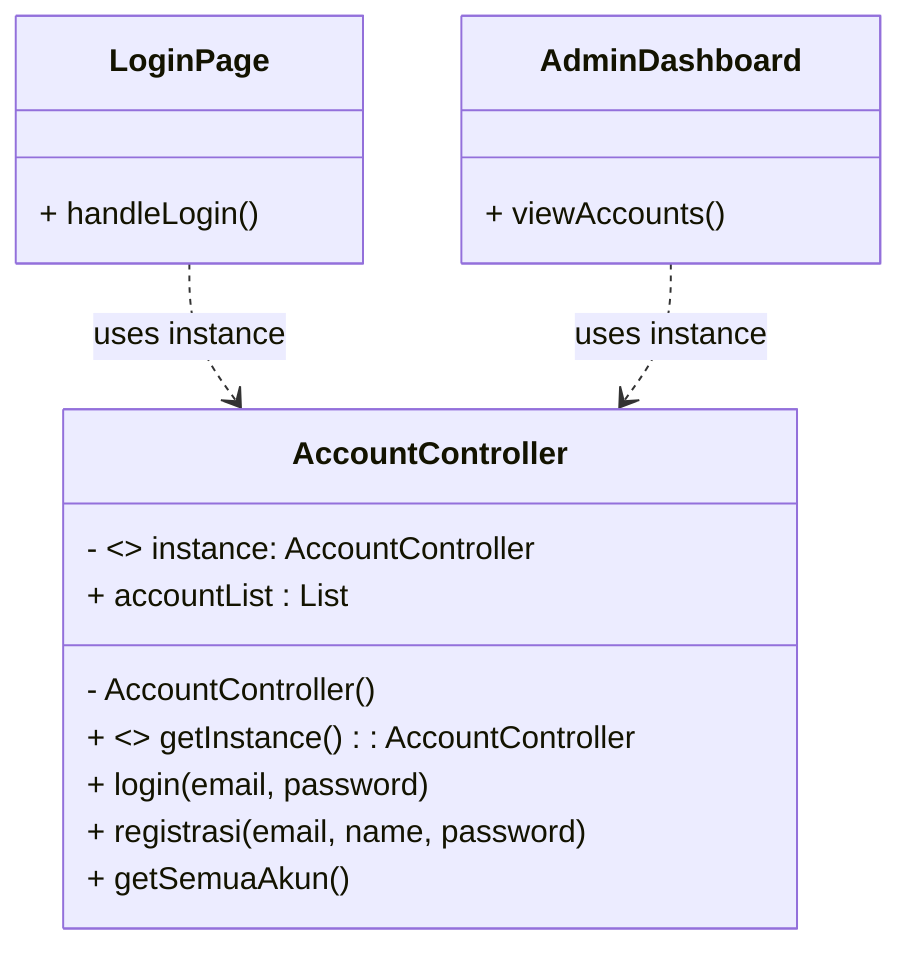
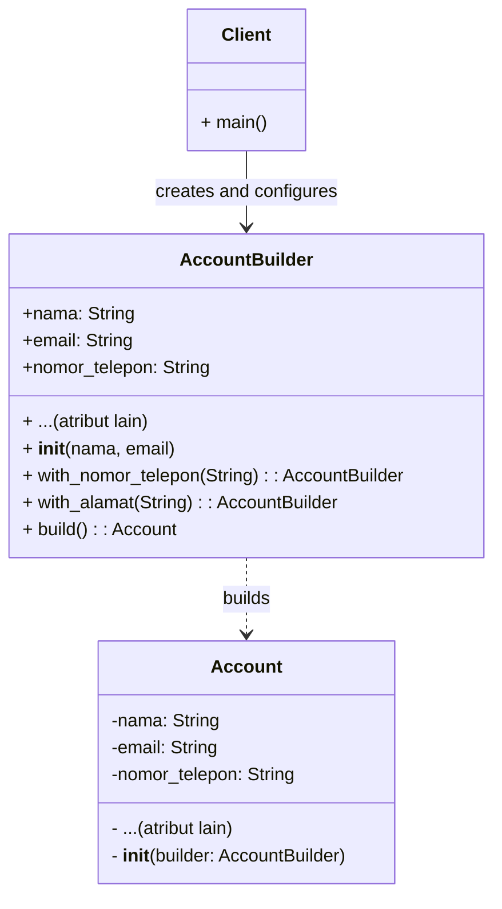

## SINGLETON

```mermaid
classDiagram
class AccountController {
    - <<static>> instance: AccountController
    + accountList : List
    - AccountController()
    + <<static>> getInstance(): AccountController
    + login(email, password)
    + registrasi(email, name, password)
    + getSemuaAkun()
}
class LoginPage{
    + handleLogin()
}
class AdminDashboard{
    + viewAccounts()
}

LoginPage ..> AccountController : uses instance
AdminDashboard ..> AccountController : uses instance
```

## BUILDER

```mermaid
classDiagram
class Account {
    -nama: String
    -email: String
    -nomor_telepon: String
    - ... (atribut lain)
    - __init__(builder: AccountBuilder)
}
class AccountBuilder {
    +nama: String
    +email: String
    +nomor_telepon: String
    + ... (atribut lain)
    + __init__(nama, email)
    + with_nomor_telepon(String): AccountBuilder
    + with_alamat(String): AccountBuilder
    + build(): Account
}
class Client {
    + main()
}

Client --> AccountBuilder : creates and configures
AccountBuilder ..> Account : builds
```