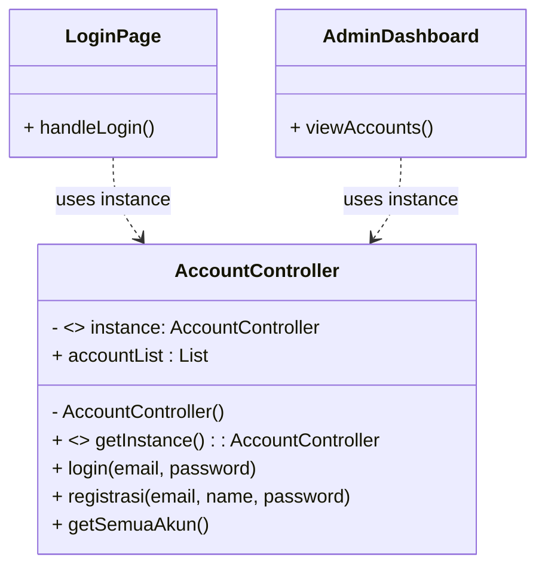

```mermaid
classDiagram
class AccountController {
    - <<static>> instance: AccountController
    + accountList : List
    - AccountController()
    + <<static>> getInstance(): AccountController
    + login(email, password)
    + registrasi(email, name, password)
    + getSemuaAkun()
}
class LoginPage{
    + handleLogin()
}
class AdminDashboard{
    + viewAccounts()
}

LoginPage ..> AccountController : uses instance
AdminDashboard ..> AccountController : uses instance
```


```mermaid
```